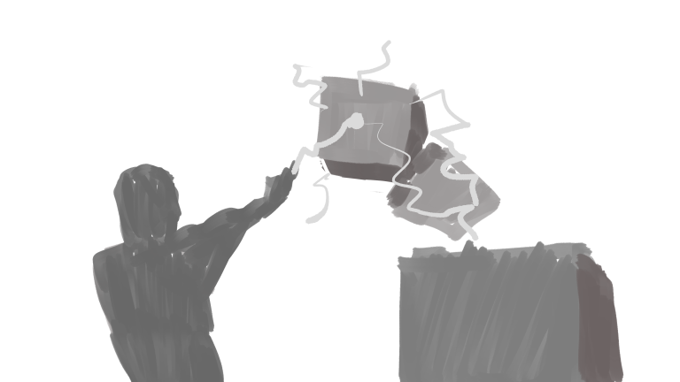

# Gameplay and mechanics

## Gameplay

The player will be stranded in a building where solving puzzle will help him escape rooms. Each rooms has a door that will be opened once the puzzle is solved.

Solving puzzle can be undestood differently :

* The player reached a zone after creating a path by objects around.

* The player changed the state of the environment to a state that would be understood as a solution to the puzzle.

## Mechanics

Various mechanics using Stride's physics system and a custom "Chemistry" system.

The player has a First-Person Shooter controller, it will be possible to :

* Walk forward and backward, Stride (Trophy if the player finishes the game by only striding left or right)
  
* Turn the camera around

* Jump at a limited height (Possibly double jump)

* Crouch

### Chemistry System

The game will introduce the concepts of temperature, conductivity and magnetic fields. For that, an object will have additional parameters :

* A material type : Metallic, Wood, Mineral, Ice etc. This will help make a simple rule system deciding how an object can be interacted with. (e.g. : Metallic objects can be influenced with magnetic fields but not burn, Wood can turn into fire but does not react to any magnetic field) (Enum)

* Thermal informations : Actual temperature, thermal conductivity and change of state temperature defining the temperature at which wood/ice would start to burn/melt. (float, float,)

* Magnetic conductivity : How much an object resists a magnetic field. (float)

* Electric conductivity : If an object can conduct electricity (bool)

### The gun

The gun will have multiple modes :

* A simple mode shooting bullets.

* A gravity mode that can move objects. 

* A temperature mode that can raise or lower temperatures thus changing the state of some objects. 

* An electric mode where the gun creates an electric current on conductive materials. 

* Possibly a "switch mode" where the player will tag 2 objects and these two objects will switch position. 

### Additional mechanics

A set of predefined vector field that will help move objects, through wind or magnetic fields.

Some examples i have (and don't want to forget) :

1. A circular vector field : $f(x,y,z) = (-x,y,z)$ 

2. An outward tornado : $f(x,y,z) = (-x+y,y,z+bias)$ 

3. An inward tornado : $f(x,y,z) = (-x-y,y,z+bias)$ 